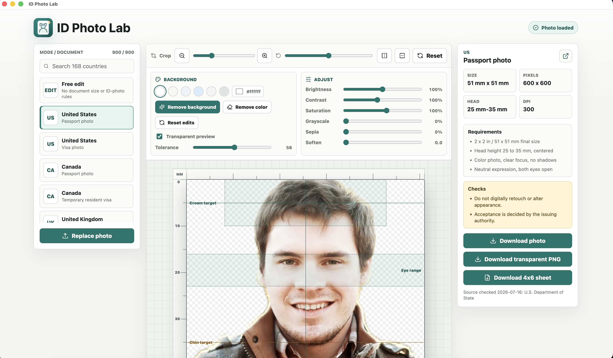

# ID Photo Lab

ID Photo Lab is a desktop photo editor for preparing passport, visa, and identity-document photos. It combines a country/document requirement catalog with practical editing tools for crop, alignment, background removal, color replacement, and export.



## What It Does

ID Photo Lab helps turn an uploaded portrait into an output photo that matches a selected document profile. It can also run in **Free edit** mode when you only want to crop, adjust, or remove a background without applying official ID-photo sizing rules.

The app is built with React, Vite, TypeScript, Electron, browser-side ONNX background removal, and local MediaPipe face detection.

## Features

- Country and document photo requirement catalog loaded from editable JSON.
- Free edit mode with no selected document specification.
- Drag, zoom, rotate, and flip controls for positioning the subject.
- Local face detection with detected face/eye overlay and one-click auto-align to document guides.
- Rulers and guide overlays for document sizing, crown/chin targets, and eye ranges.
- Export readiness checks for photo loaded, output size, background, alignment, source freshness, and appearance edits.
- Offline-capable AI background removal in packaged desktop builds.
- Edge color removal fallback for simple flat-color backgrounds.
- Background swatches, custom background color, and transparent preview.
- Brightness, contrast, saturation, grayscale, sepia, and soften adjustments.
- Exports for final photo, transparent PNG, and 4x6 print sheets when the selected spec supports physical sizing.
- Electron packaging for macOS and Windows.

## How To Use

1. Open the app.
2. Upload a front-facing portrait.
3. Choose **Free edit** or select a country/document profile.
4. Position the face with drag, zoom, rotate, and flip controls.
5. Use **Detect face** and **Auto-align** when you want the app to fit the portrait to the selected guide.
6. Use **Remove background** when a transparent cutout is needed.
7. Pick a replacement background color or keep transparent preview enabled.
8. Check the readiness panel, then download the photo, transparent PNG, or 4x6 sheet.

Document requirements can change. Always verify final acceptance requirements with the issuing authority before submitting an official application.

## Privacy and Disclaimer

ID Photo Lab is designed for local image processing by default. The current app does not include analytics, account login, advertising SDKs, or server-side photo upload.

- [Privacy Policy](public/privacy.html)
- [Terms and Disclaimer](public/terms.html)

## Development

Install dependencies:

```bash
npm ci
```

Run the web app:

```bash
npm run dev
```

Run the Electron app in development mode:

```bash
npm run electron:dev
```

Build the app:

```bash
npm run build
```

## Local Model Assets

The packaged app includes the required background-removal and face-detection model/runtime assets locally, so first-use background removal and face detection do not need to download models from the network.

For source builds, the assets are vendored by:

```bash
npm run assets:vendor
npm run assets:verify
```

This command downloads the matching `@imgly/background-removal-data` archive once, filters it to the resources used by this app, copies the MediaPipe vision runtime from `@mediapipe/tasks-vision`, and downloads the BlazeFace face-detector model. Generated folders under `public/` are intentionally ignored by Git. Release builds include them through Vite/Electron packaging.

`npm run assets:verify` checks that the vendored background-removal assets, MediaPipe assets, built `dist/` files, and Electron packaging rules are still aligned before desktop binaries are produced.

## Packaging

The Makefile wraps the package scripts:

```bash
make package-macos
make package-windows
make package-windows-arm64
make package
```

Generated packages are written to `release/`.

Current packages are unsigned. macOS Gatekeeper and Windows SmartScreen may warn until code signing and notarization are configured.

Signed packaging targets are available once certificates and notarization credentials are configured:

```bash
make package-macos-signed
make package-windows-signed
```

See [Code Signing and Notarization](docs/code-signing.md) for the release checklist and required secrets.

## GitHub Releases

Do not commit the generated `release/` folder or desktop binaries to the repository. They are large build artifacts and are intentionally ignored by Git.

To publish downloadable macOS and Windows builds from GitHub:

```bash
git tag v0.1.0
git push origin v0.1.0
```

The GitHub Actions release workflow builds the app on macOS and Windows runners, then uploads the generated `.dmg`, `.zip`, and `.exe` files to the matching GitHub Release.

You can also run the **Release** workflow manually in GitHub Actions and provide a tag such as `v0.1.0`.

See [Release Process](docs/release.md) for the quality gate, rerun procedure, and artifact checklist.

## Project Structure

- `src/App.tsx` - main editor UI and workflow.
- `src/imageCanvas.ts` - rendering, export, and background-removal helpers.
- `src/data/photoSpecs.json` - editable document photo specification catalog.
- `electron/` - Electron main process and preload bridge.
- `scripts/` - catalog, icon, and model-asset generation scripts.
- `public/background-removal/` - generated local model assets, ignored by Git.

## License

ID Photo Lab is licensed under the GNU Affero General Public License v3.0. See [LICENSE](LICENSE).

The AGPL license is used because this project bundles and integrates `@imgly/background-removal`, which is distributed under the AGPL. See [NOTICE.md](NOTICE.md) for third-party license notes.
